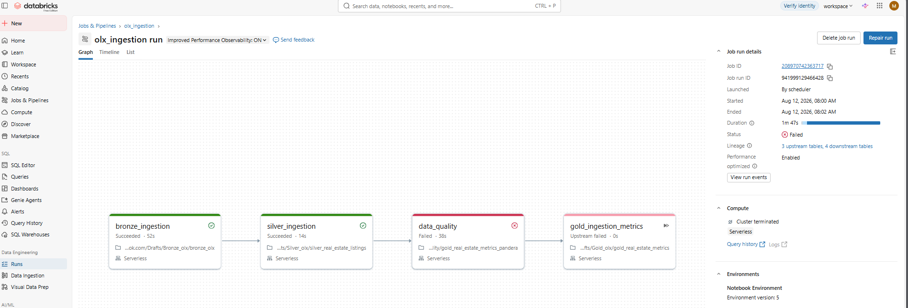

# olx_data_engineering Pipeline
Pipeline engenharia de dados desenvolvido com databricks, pyspark e delta lake  seguindo a arquitetura Medallion(Bronze, Silver, Gold).

# Objetivo
Este projeto tem como objetivo construir um pipeline de dados utilizando anúncios  de imóveis da  OLX, aplicando boas práticas da Engenharia de dados para transformar dados brutos em informações confiáveis para análise e deshboards.
Ao longo do pipeline são realizadas etapas  de ingestão, limpeza, padronização, enriquecimento  dos dados de  métricas de negócios.

# Justificativa
Em projetos reais de dados, as informações  normalmente chegam incompletas, com registros  duplicados, valores nulos e diferentes  formatos.
Este projeto demonstra como organizar essas informações  em camadas,garantido maior  qualidade dos dados, melhor governança  e facilidade para consumo por ferramentas analíticas.
Além disso, foi desenvolvido para práticar  conceitos utilizados no mercado, como Delta Lake, Databricks, Pyspark e a  Arquitetura Medallion

# Arquitetura Medallion
A arquitetura Medallion organiza os dados em três camadas:

# Bronze
-Responsável pela ingestão dos dados exatamente como foram  recebidos da origem.
-atividades
-Leitura do arquivo CSV da OLX.
-Armazenamento  dos dados brutos.
-Escrita em formato Delta.

# Silver
Camada responsável pela qualidade dos dados.
-limpeza
-Padronização
-Conversão de tipos
-Remoção de duplicidades

# Gold
-Camada destinada ás regras de negócios.
-Preço por metro quadrado
-categoria de preço
-total de cômodos
-Indicador de garagem
-Data processamento

# Dicionário de Dados - Camada Gold
Objetivo
A camada Gold contém os dados refinados e enriquecidos da OLX, preparados para consumo analítico, dashboards e geração de indicadores. Nesta camada são criadas métricas derivadas para facilitar a análise dos imóveis.

## Estrutura da Tabela

| Coluna | Tipo | Origem | Descrição |
|---------|------|---------|-----------|
| titulo | STRING | Silver | Título do anúncio do imóvel. |
| url | STRING | Silver | Link original do anúncio da OLX. |
| preco | DOUBLE | Silver | Valor anunciado do imóvel. |
| tipo | STRING | Silver | Tipo do imóvel (Casa, Apartamento, Terreno etc.). |
| bairro | STRING | Silver | Bairro do imóvel. |
| cidade | STRING | Silver | Cidade onde o imóvel está localizado. |
| estado | STRING | Silver | Unidade Federativa (UF). |
| cep | STRING | Silver | CEP informado no anúncio. |
| quartos | INT | Silver | Quantidade de quartos. |
| banheiros | INT | Silver | Quantidade de banheiros. |
| garagens | INT | Silver | Quantidade de vagas de garagem. |
| area_m2 | DOUBLE | Silver | Área do imóvel em metros quadrados. |
| descricao | STRING | Silver | Descrição completa do anúncio. |
| imagens | STRING | Silver | URL da imagem principal do imóvel. |
| preco_m2 | DOUBLE | Gold | Preço do metro quadrado (preço ÷ área). |
| categoria_preco | STRING | Gold | Classificação do imóvel em baixo, médio ou alto. |
| total_comodos | INT | Gold | Soma da quantidade de quartos e banheiros. |
| possui_garagem | STRING | Gold | Indica se o imóvel possui garagem. |
| dt_carga | TIMESTAMP | Gold | Data e hora de processamento da tabela. |

# Métricas criadas 
A camada Gold adiciona métricas derivadas para facilitar análises:

- *preco_m2:* preço dividido pela área do imóvel.
- *categoria_preco:* classifica o imóvel em Baixo, Médio ou Alto.
- *total_comodos:* soma dos quartos e banheiros.
- *possui_garagem:* informa se o imóvel possui garagem.
- *dt_carga:* registra a data e hora de processamento da tabela.

  # Métricas calculadas na tabela Gold
  Nesta camada são criadas métricas derivadas para facilitar análises dos imóveis e apoiar a construção de dashboards.

| Coluna | Tipo | Regra de Negócio | Objetivo |
|--------|------|------------------|----------|
| preco_m2 | DOUBLE | preco / area_m2, quando area_m2 > 0 | Comparar imóveis pelo preço do metro quadrado. |
| categoria_preco | STRING | Baixo (< R$ 300.000), Médio (R$ 300.000 a R$ 699.999) e Alto (≥ R$ 700.000) | Classificar os imóveis por faixa de preço. |
| total_comodos | INT | Soma de quartos + banheiros | Facilitar análises sobre o tamanho do imóvel. |
| possui_garagem | STRING | "Sim" quando garagens > 0; caso contrário, "Não" | Identificar rapidamente imóveis que possuem garagem. |
| dt_carga | TIMESTAMP | Data e hora da execução do pipeline | Registrar quando os dados foram processados. |
  

##  Data Quality
Foram implementadas regras de qualidade de dados para garantir a confiabilidade da camada Gold antes da disponibilização para consumo analítico.

As validações foram posteriormente evoluídas com a utilização da biblioteca Pandera, permitindo estruturar e automatizar as regras de Data Quality dentro do pipeline.

### Regras implementadas

-  DQ01 - Título obrigatório
-  DQ02 - Preço maior que zero
-  DQ03 - Área maior que zero quando informada
-  DQ04 - URL sem duplicidade
-  DQ05 - Categoria de preço válida
-  DQ06 - Indicador de garagem válido
-  DQ07 - Data de carga obrigatória

### Resultado das validações

O processo gera um relatório contendo a regra validada, a coluna analisada, a quantidade de erros, o status da validação e a data/hora da execução.

# Data Quality com Pandera

Como evolução do processo de qualidade de dados, foi implementada a biblioteca *Pandera* para estruturar e automatizar as validações realizadas sobre os dados da camada Gold.

Com o Pandera, as regras de qualidade são definidas de forma estruturada, permitindo validar o schema e as regras de negócio antes da disponibilização dos dados para consumo analítico.

As validações incluem:

- Campos obrigatórios;
- Tipos de dados;
- Valores maiores que zero;
- Valores permitidos;
- Registros nulos ou inválidos;
- Regras de negócio da camada Gold.

Em caso de falha nas validações críticas, a execução do pipeline é interrompida, garantindo que apenas dados que atendam aos critérios de qualidade sejam disponibilizados para consumo analítico.

# Fluxo do PIPELINE
Arquivo CSV da OLX
        │
        ▼
Bronze (Dados Brutos)
        │
        ▼
Silver (Limpeza e Tratamento)
        │
        ▼
Gold (Métricas de Negócio)
        │
        ▼
Data Quality (Validação das Regras)
        │
        ▼
Relatório de Data Quality
        │
        ▼
Análises e Dashboards

# Orquestração do Pipeline com Databricks Jobs

O pipeline foi orquestrado utilizando Databricks Jobs, permitindo a execução automatizada e sequencial das etapas da arquitetura Medallion, desde a ingestão dos dados brutos até as validações de Data Quality.

# Fluxo de execução
Bronze Ingestion
       ↓
Silver Ingestion
       ↓
Gold Ingestion
       ↓
Data Quality

# Execução do pipeline

# Tecnologias
-Python
-PySpark
-Spark SQL
-Databricks
-Delta Lake
-Github
-Git
-Databricks Jobs

# Orquestração e Automação do Pipeline

O pipeline foi configurado utilizando Databricks Jobs, permitindo a orquestração e execução automatizada das etapas da arquitetura Medallion.

 # Fluxo de execução

Bronze → Silver → Data Quality → Gold

As tasks foram configuradas com dependências de execução, garantindo que cada etapa seja iniciada somente após a conclusão bem-sucedida da etapa anterior.

Esse fluxo ajuda a evitar que dados não processados ou que não atendam aos critérios de qualidade avancem para a camada seguinte.

 # Validação de Data Quality

Após o processamento da camada Silver, os dados passam pela etapa de Data Quality, onde são aplicadas regras de validação antes da geração da camada Gold.

As validações foram implementadas utilizando Pandera, permitindo verificar critérios de qualidade e identificar registros que não atendam às regras definidas.

Caso uma validação considerada crítica falhe, a execução do pipeline pode ser interrompida, impedindo que dados inconsistentes avancem para a camada Gold.

# Agendamento automático

O Job possui um agendamento (Schedule) configurado no Databricks para executar o pipeline automaticamente todos os dias às 08:00.

Com isso, o processamento não depende de execução manual dos notebooks, tornando o pipeline mais automatizado, reproduzível e confiável.

# Monitoramento

O Databricks Jobs permite acompanhar cada execução do pipeline, incluindo:

* status das tasks;
* tempo de execução;
* dependências entre as etapas;
* identificação de falhas;
* histórico das execuções.

 # Orquestração do job no Databricks

# Resultado Final 
Ao final do projeto, foi desenvolvido um pipeline de Engenharia de Dados utilizando Databricks e PySpark, seguindo a arquitetura Medallion.

O fluxo contempla:

* Bronze: ingestão e armazenamento dos dados brutos;
* Silver: limpeza, padronização, tratamento de valores nulos e remoção de duplicidades;
* Data Quality: aplicação de regras de qualidade utilizando Pandera, validando os dados antes de avançarem para a camada Gold;
* Gold: disponibilização dos dados tratados e preparados para consumo analítico;
* Orquestração: criação de um Databricks Job com dependências entre as tasks;
* Automação: configuração de um agendamento (Schedule) para execução automática diária às 08:00;
* Monitoramento: acompanhamento do status, tempo de execução e possíveis falhas das tasks pelo Databricks Jobs.

Com isso, o projeto evoluiu de um processamento manual para um pipeline automatizado, orquestrado e com controles de qualidade de dados, aproximando a solução de um cenário real de Engenharia de Dados.
