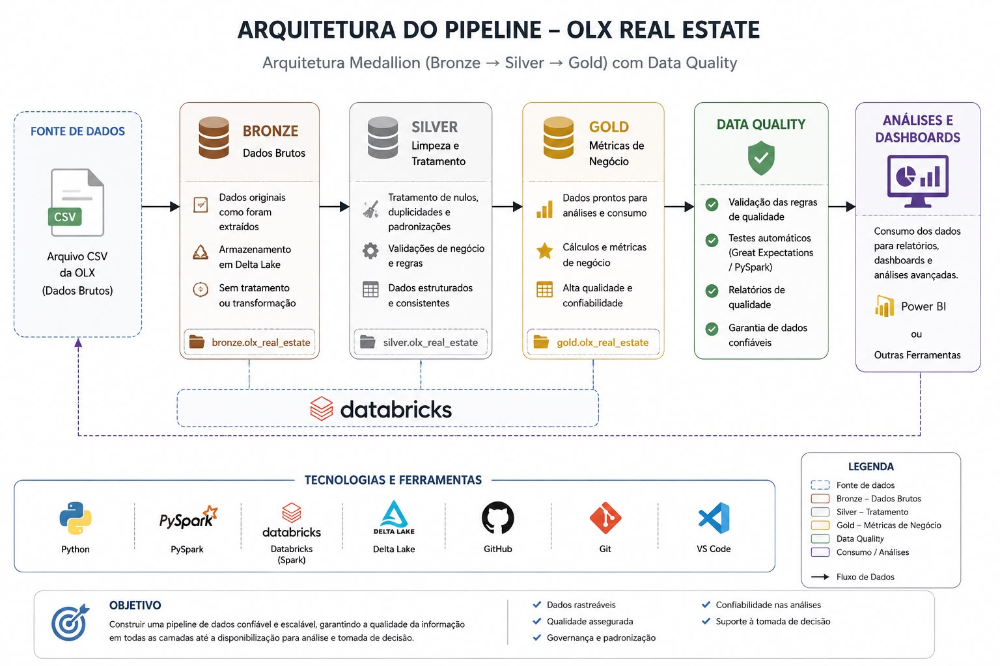
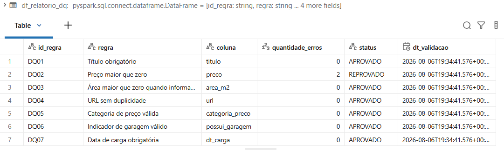
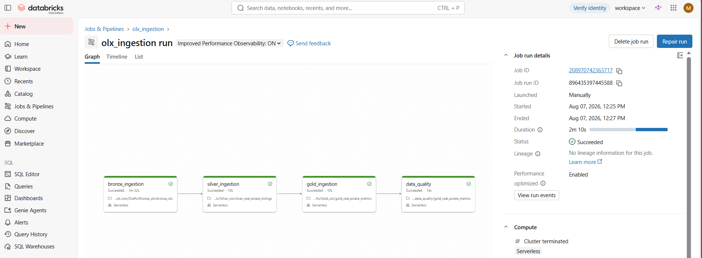

# olx_data_engineering Pipeline
Pipeline engenharia de dados desenvolvido com databricks, pyspark e delta lake  seguindo a arquitetura Medallion(Bronze, Silver, Gold).

# Objetivo
Este projeto tem como objetivo construir um pipeline de dados utilizando anúncios  de imóveis da  OLX, aplicando boas práticas da Engenharia de dados para transformar dados brutos em informações confiáveis para análise e deshboards.
Ao longo do pipeline são realizadas etapas  de ingestão, limpeza, padronização, enriquecimento  dos dados de  métricas de negócios.

# Justificativa
Em projetos reais de dados, as informações  normalmente chegam incompletas, com registros  duplicados, valores nulos e diferentes  formatos.
Este projeto demonstra como organizar essas informações  em camadas,garantido maior  qualidade dos dados, melhor governança  e facilidade para consumo por ferramentas analíticas.
Além disso, foi desenvolvido para práticar  conceitos utilizados no mercado, como Delta Lake, Databricks, Pyspark e a  Arquitetura Medallion

# Arquitetura Medallion
A arquitetura Medallion organiza os dados em três camadas:

# Bronze
-Responsável pela ingestão dos dados exatamente como foram  recebidos da origem.
-atividades
-Leitura do arquivo CSV da OLX.
-Armazenamento  dos dados brutos.
-Escrita em formato Delta.

# Silver
Camada responsável pela qualidade dos dados.
-limpeza
-Padronização
-Conversão de tipos
-Remoção de duplicidades

# Gold
-Camada destinada ás regras de negócios.
-Preço por metro quadrado
-categoria de preço
-total de cômodos
-Indicador de garagem
-Data processamento

# Dicionário de Dados - Camada Gold
Objetivo
A camada Gold contém os dados refinados e enriquecidos da OLX, preparados para consumo analítico, dashboards e geração de indicadores. Nesta camada são criadas métricas derivadas para facilitar a análise dos imóveis.

## Estrutura da Tabela

| Coluna | Tipo | Origem | Descrição |
|---------|------|---------|-----------|
| titulo | STRING | Silver | Título do anúncio do imóvel. |
| url | STRING | Silver | Link original do anúncio da OLX. |
| preco | DOUBLE | Silver | Valor anunciado do imóvel. |
| tipo | STRING | Silver | Tipo do imóvel (Casa, Apartamento, Terreno etc.). |
| bairro | STRING | Silver | Bairro do imóvel. |
| cidade | STRING | Silver | Cidade onde o imóvel está localizado. |
| estado | STRING | Silver | Unidade Federativa (UF). |
| cep | STRING | Silver | CEP informado no anúncio. |
| quartos | INT | Silver | Quantidade de quartos. |
| banheiros | INT | Silver | Quantidade de banheiros. |
| garagens | INT | Silver | Quantidade de vagas de garagem. |
| area_m2 | DOUBLE | Silver | Área do imóvel em metros quadrados. |
| descricao | STRING | Silver | Descrição completa do anúncio. |
| imagens | STRING | Silver | URL da imagem principal do imóvel. |
| preco_m2 | DOUBLE | Gold | Preço do metro quadrado (preço ÷ área). |
| categoria_preco | STRING | Gold | Classificação do imóvel em baixo, médio ou alto. |
| total_comodos | INT | Gold | Soma da quantidade de quartos e banheiros. |
| possui_garagem | STRING | Gold | Indica se o imóvel possui garagem. |
| dt_carga | TIMESTAMP | Gold | Data e hora de processamento da tabela. |

# Métricas criadas 
A camada Gold adiciona métricas derivadas para facilitar análises:

- *preco_m2:* preço dividido pela área do imóvel.
- *categoria_preco:* classifica o imóvel em Baixo, Médio ou Alto.
- *total_comodos:* soma dos quartos e banheiros.
- *possui_garagem:* informa se o imóvel possui garagem.
- *dt_carga:* registra a data e hora de processamento da tabela.

  # Métricas calculadas na tabela Gold
  Nesta camada são criadas métricas derivadas para facilitar análises dos imóveis e apoiar a construção de dashboards.

| Coluna | Tipo | Regra de Negócio | Objetivo |
|--------|------|------------------|----------|
| preco_m2 | DOUBLE | preco / area_m2, quando area_m2 > 0 | Comparar imóveis pelo preço do metro quadrado. |
| categoria_preco | STRING | Baixo (< R$ 300.000), Médio (R$ 300.000 a R$ 699.999) e Alto (≥ R$ 700.000) | Classificar os imóveis por faixa de preço. |
| total_comodos | INT | Soma de quartos + banheiros | Facilitar análises sobre o tamanho do imóvel. |
| possui_garagem | STRING | "Sim" quando garagens > 0; caso contrário, "Não" | Identificar rapidamente imóveis que possuem garagem. |
| dt_carga | TIMESTAMP | Data e hora da execução do pipeline | Registrar quando os dados foram processados. |
  

##  Data Quality

Foram implementadas regras de qualidade de dados para garantir a confiabilidade da camada Gold antes da disponibilização para consumo analítico.

### Regras implementadas

-  DQ01 - Título obrigatório
-  DQ02 - Preço maior que zero
-  DQ03 - Área maior que zero quando informada
-  DQ04 - URL sem duplicidade
-  DQ05 - Categoria de preço válida
-  DQ06 - Indicador de garagem válido
-  DQ07 - Data de carga obrigatória

### Resultado das validações

# Fluxo do PIPELINE
Arquivo CSV da OLX
        │
        ▼
Bronze (Dados Brutos)
        │
        ▼
Silver (Limpeza e Tratamento)
        │
        ▼
Gold (Métricas de Negócio)
        │
        ▼
Data Quality (Validação das Regras)
        │
        ▼
Relatório de Data Quality
        │
        ▼
Análises e Dashboards

# Orquestração do Pipeline com Databricks Jobs

O pipeline foi orquestrado utilizando Databricks Jobs, permitindo a execução automatizada e sequencial das etapas da arquitetura Medallion, desde a ingestão dos dados brutos até as validações de Data Quality.

# Fluxo de execução
Bronze Ingestion
       ↓
Silver Ingestion
       ↓
Gold Ingestion
       ↓
Data Quality

# Execução do pipeline

# Tecnologias
-Python
-PySpark
-Databricks
-Delta Lake
-Github
-Git

# Resultado Final 
Ao final do pipeline, é gerada uma tabela Gold contendo dados tratados, padronizados e enriquecidos para consumo analítico.

Além das transformações de negócio, foi implementada uma camada de Data Quality responsável por validar a qualidade dos dados antes da disponibilização da tabela final. As validações garantem maior confiabilidade das informações utilizadas em análises e dashboards.

As principais validações realizadas incluem:

- Verificação de título obrigatório.
- Validação de preços maiores que zero.
- Validação de área maior que zero quando informada.
- Verificação de URLs duplicadas.
- Validação da categoria de preço.
- Validação do indicador de garagem.
- Verificação da data de carga.

Os resultados dessas validações são consolidados em um relatório de Data Quality, permitindo acompanhar a conformidade da tabela Gold e identificar possíveis inconsistências durante o processamento.
